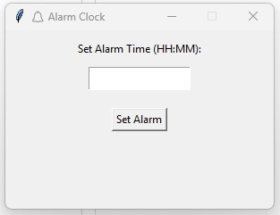

# 🔔 GUI Alarm Clock

A simple Python GUI alarm clock with sound and scheduling.

## 📸 Screenshot



## Features

- Set alarm time in 24-hour format (HH:MM)
- Countdown runs in the background using threading
- Plays alarm sound using pygame
- Built with Tkinter

## How to Run

```bash
pip install pygame
python alarm_gui.py
