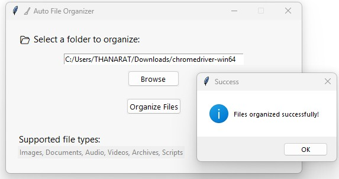

# 🧹 Auto File Organizer for Desktop

A simple and professional-looking Python GUI application to automatically organize files on your desktop (or any selected folder) into categorized subfolders based on file types.

---

## 📸 Preview



---

## ✨ Features

- Automatically categorizes files into folders like:
  - 📁 Images (`.jpg`, `.png`, `.gif`, etc.)
  - 📄 Documents (`.pdf`, `.docx`, `.txt`, etc.)
  - 🎵 Music (`.mp3`, `.wav`)
  - 🎞️ Videos (`.mp4`, `.mkv`)
  - 📦 Archives (`.zip`, `.rar`)
  - ⚙️ Code files (`.py`, `.js`, `.html`, etc.)
- Intuitive GUI with folder selection dialog
- Progress indicator (status label)
- Built with `Tkinter`

---

## 🛠️ How to Run

1. Install Python (if not already installed)
2. Install dependencies (if any):
    ```bash
    pip install -r requirements.txt
    ```
    > Note: This app only uses standard libraries.
3. Run the app:
    ```bash
    python auto_file_organizer.py
    ```

---

## 📁 Files

- `auto_file_organizer.py` – Main source code
- `README.md` – This file
- `LICENSE` – MIT License
- `screenshot.png` – Screenshot preview (optional)

---

## 📌 Notes

This app is intended to work best with folders like `Desktop`, `Downloads`, etc. Be cautious when organizing system directories.

---

## 📜 License

This project is licensed under the [MIT License](../LICENSE).
