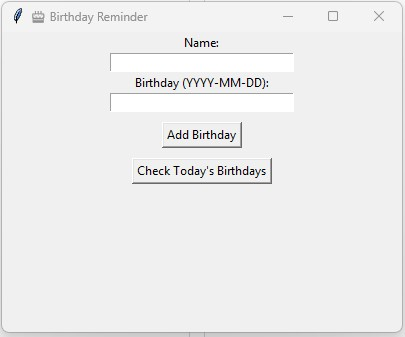

# 🔔 GUI Alarm Clock

A simple Python GUI alarm clock with sound and scheduling.

## 📸 Screenshot



## Features

- Set alarm time in 24-hour format
- Plays sound when alarm time is reached
- Uses `pygame` for audio

## How to Run

```bash
pip install pygame
python alarm_gui.py
