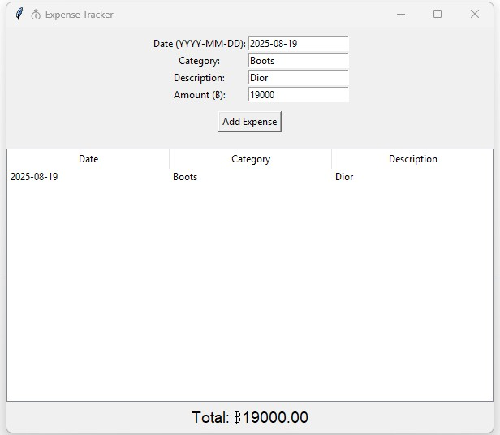

# 💰 Expense Tracker GUI

A simple personal expense tracker built with Python and Tkinter.

## 📸 Screenshot



## Features

- Add daily expenses with category and description
- View all expense records
- Automatically calculates total amount
- Stores data in SQLite database

## How to Run

```bash
python expense_tracker_gui.py
