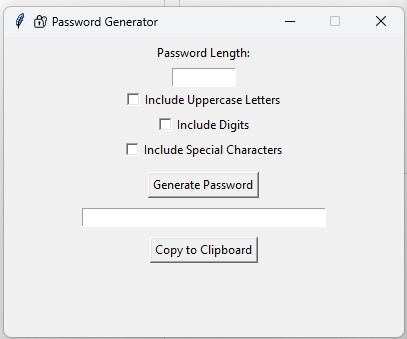

# 🔐 GUI Random Password Generator

A simple Python GUI application to generate secure, random passwords based on user-defined settings.

## 📸 Screenshot



## Features

- Choose password length
- Include uppercase letters, digits, and special characters
- Generate password and copy it to clipboard
- Built with Tkinter

## How to Run

```bash
pip install pyperclip
python password_generator_gui.py
