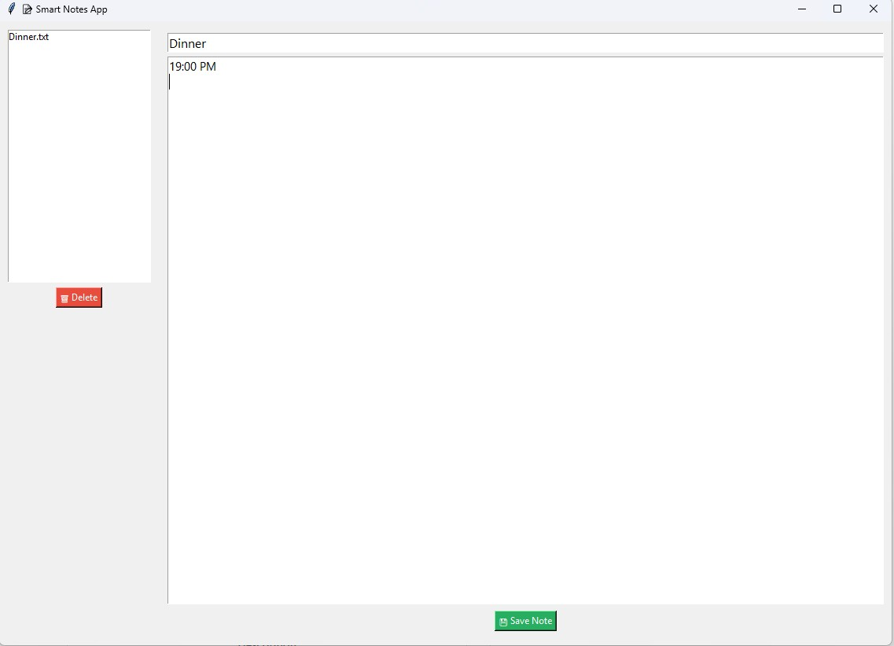

# 📝 Smart Notes App

A clean and simple note-taking desktop app built with Python and Tkinter.  
Save, view, and delete your notes instantly with a minimal and efficient GUI.

---

## 📸 Screenshot



> 💡 Place your GUI screenshot here, named `screenshot.png` in the same folder.

---

## ✨ Features

- Create and save notes with titles
- View all saved notes in a side panel
- Auto-load note content when selected
- Delete notes with one click
- Uses plain `.txt` files in a local `notes/` folder
- Built entirely with standard Python libraries

---

## 📦 Requirements

- Python 3.7 or higher
- No external packages required

---

## 🚀 How to Run

```bash
python smart_notes_app.py
