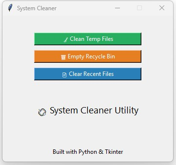

# 🧼 System Cleaner GUI

A lightweight Python utility to help clean up unnecessary files from your system with just a few clicks.  
Perfect for freeing up disk space and improving system performance — with a clean, user-friendly interface built using Tkinter.

---

## 📸 Screenshot



> Replace `screenshot.png` with your actual screenshot image of the GUI.

---

## ✨ Features

- 🧹 Clean **temporary files**
- 🗑 Empty the **Recycle Bin**
- 📄 Clear the **Recent Files** list
- Built with Python `Tkinter` — no external dependencies

---

## 📦 Requirements

- Python 3.7+
- Runs on Windows (uses `powershell.exe` to empty Recycle Bin)

---

## 🚀 How to Run

```bash
python system_cleaner_gui.py
